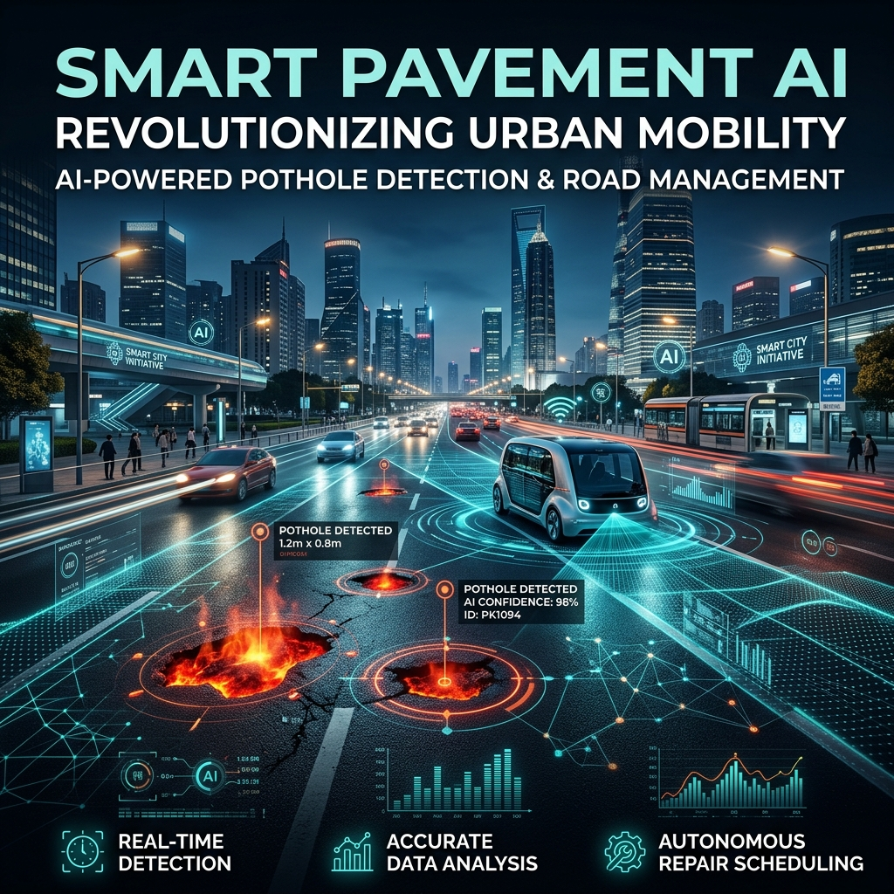
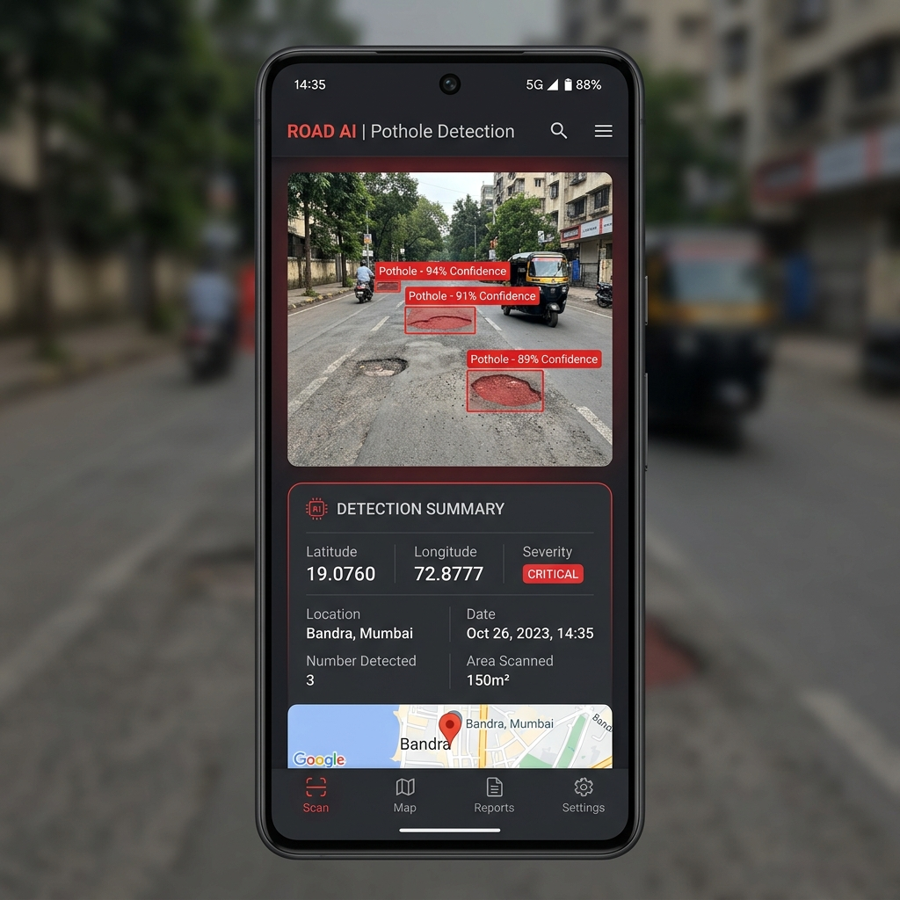
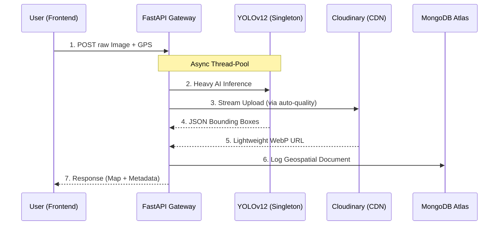

# AI-Smart City: Real-Time Crowdsourced Road Surface Monitoring

# [LIVE DEMO](https://ai-smart-city-sigma.vercel.app/)




## 🌟 Mission & Civic Impact
Urban road infrastructure is the backbone of modern cities. However, traditional monitoring is slow, expensive, and reactive. **AI-Smart City** flips the script by empowering citizens to become "Road Inspectors." Using deep learning at the edge and a high-throughput cloud cluster, we transform raw photos into actionable geospatial data.

### **Core Objectives:**
- **High-Fidelity AI Inference**: Process high-resolution (4MB+) images through **YOLOv12** for maximum detection accuracy.
- **Data Compression & Storage**: Automated CDN pipelines to minimize storage footprints while retaining visual evidence.
- **Geospatial Intelligence**: Real-time Heatmaps that visually cluster pothole densities for proactive civic maintenance.

---

## 📱 The Three-Module Experience

The platform is decoupled into three distinct, user-centric modules:

### **1. The Landing Page**
A clean, high-impact introduction explaining the civic importance of the project. Features a "Call-to-Action" for reporting new hazards.

### **2. The Scan Dashboard**
The heart of the system. When a user uploads an image:
- **HTML5 Geolocation**: Simultaneously extracts precise GPS coordinates.
- **AI Inference Card**: Displays detection results (bounding boxes + confidence) alongside metadata like Date, Time, and Location.



### **3. The Heatmap & Registry**
An administrative dashboard querying the **MongoDB Atlas** cluster:
- **Map View**: Uses **Leaflet.js** to show red "heat zones" where pothole density is high.
- **Registry View**: A structured list of recently logged hazards with thumbnails and timestamps.

---

## 🏗️ Operational Workflow (Edge-to-Cloud)



---

## ⚡ High-Tech Stack & Performance

### **Machine Learning (YOLOv12)**
We use the state-of-the-art **YOLOv12** architecture. The model is loaded as a **Singleton** during the FastAPI lifespan to eliminate cold-start latency. 

### **Inference Strategy: Thread-Pooling**
AI inference is CPU-bound. To keep the server responsive for multiple users, we use `asyncio.to_thread` to push detection tasks to background workers.

### **Cloud Storage (Cloudinary CDN)**
Images are automatically compressed to **WebP** formats with an `auto-quality` flag, reducing a 4MB file to ~200KB for rapid dashboard loading.

### **Persistence (MongoDB Atlas)**
Detections are indexed as **GeoJSON Points**, enabling high-speed geospatial queries for the heatmap.

---

## 📂 Expert Project Structure

```plaintext
ai-pothole/
├── backend/                   # FastAPI Inference Engine (Micro-Layered)
│   ├── .env                   # Infrastructure Secrets (CDN/DB)
│   ├── requirements.txt       # AI/Web Dependencies
│   ├── yolov12l.pt            # Pre-trained Weights
│   └── app/
│       ├── main.py            # Entry point & Lifespan logic
│       ├── api/routes.py      # Traffic Controller
│       ├── services/          # Core Brain (AI, Cloudinary, DB logic)
│       └── schemas/models.py  # Data Validation (Pydantic)
│
└── frontend/                   # React.js (Vite + Tailwind)
    ├── src/
    │   ├── pages/             # Landing, Scan Dashboard, Map
    │   ├── components/        # UI Segments (Layouts, Sections)
    │   └── lib/               # Utility functions
    └── tailwind.config.js      # Custom Theme (Dark Mode)
```

---

## 🚀 Installation & Setup

### **1. Configure Secrets**
Rename `backend/.env.example` to `backend/.env` and provide your credentials.

### **2. Setup Backend (Logic)**
```bash
cd backend
pip install -r requirements.txt
uvicorn app.main:app --reload
```

### **3. Setup Frontend (UI)**
```bash
cd frontend
npm install
npm run dev
```

---

## 🌐 Global Infrastructure Roadmap
- **Phase 1**: Local development & YOLOv12 model tuning.
- **Phase 2**: MongoDB Atlas cluster deployment & Cloudinary CDN integration.
- **Phase 3**: Scaling with Vercel (Frontend) and Hugging Face/Render (Backend).

---
**Developed for Smarter Urban Infrastructure.**
