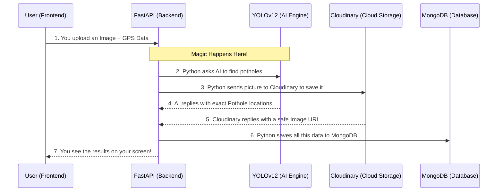

# AI-Smart City: Real-Time Crowdsourced Road Surface Monitoring

# [LIVE DEMO](https://ai-smart-city-sigma.vercel.app/)


## 🌟 Mission & Civic Impact
Urban road infrastructure is the backbone of modern cities. However, traditional monitoring is slow, expensive, and reactive. **AI-Smart City** flips the script by empowering citizens to become "Road Inspectors." Using deep learning at the edge and a high-throughput cloud cluster, we transform raw photos into actionable geospatial data.

### **Core Objectives:**
- **High-Fidelity AI Inference**: Process high-resolution (4MB+) images through an advanced **YOLOv12** artificial intelligence model for maximum pothole detection accuracy.
- **Data Compression & Storage**: Automatically shrink and store images using **Cloudinary** so our database remains fast and cheap to run, while rigorously retaining visual evidence.
- **Geospatial Intelligence**: Generate real-time interactive **Heatmaps** that visually cluster pothole densities, helping city planners coordinate proactive civic maintenance.

---

## 💻 The Technology Stack (How it Works)

This project is built using a modern decoupled architecture, meaning the frontend (what you see) and backend (the brain) are totally separate but talk to each other seamlessly.

### **Frontend (The User Interface)**
Built to be fast and look beautiful anywhere.
- **React 19 & Vite**: The core engine to build our interactive user interface and make sure the website loads instantly.
- **Tailwind CSS & Framer Motion**: Provides the sleek "Dark Surface" styling and all the smooth animations you see when buttons are clicked.
- **Leaflet & React-Leaflet**: Tools used to draw our interactive street maps and heatmaps.

### **Backend (The "Brain" & AI Engine)**
Built to handle heavy calculations and store data securely.
- **FastAPI (Python)**: A lightning-fast server framework that receives images from the frontend and responds with results.
- **YOLOv12 (Ultralytics)**: The powerful AI computer vision brain that actually "looks" at the picture and finds the potholes.
- **MongoDB Atlas**: Our database where we save the exact GPS coordinates and details of every pothole found.
- **Cloudinary**: A cloud storage system that safely keeps all the images uploaded by users.

---

## 📱 The Three-Module Experience

The platform is divided into three distinct, user-centric areas:

### **1. The Landing Page**
A clean, high-impact introduction explaining the civic importance of the project. Features a clear "Call-to-Action" to guide new users to start reporting hazards right away.

### **2. The Scan Dashboard (AI Client)**
The heart of the system. Here is what happens when a user uploads an image:
- **HTML5 Geolocation**: The browser automatically (with permission) finds the exact GPS coordinates of where you are standing.
- **AI Inference Card**: We use an advanced HTML feature called `<canvas>` to literally draw boxes around the potholes on your screen based on the AI's math, showing you exactly what the AI found.


### **3. The Heatmap & Registry (Admin Dashboard)**
An administrative dashboard querying the **MongoDB Atlas** database:
- **Map View**: Uses **Leaflet.js** to display a world map with red "heat zones" where pothole density is high.
- **Registry View**: A scrollable, structured list of all recently logged hazards with image thumbnails, severity levels, and exact timestamps.

---

## 🏗️ Operational Workflow (Edge-to-Cloud)

*Wondering exactly what happens when you press "Upload"? Here is the step-by-step journey of your photo!*



---

## 📂 Project Structure

This project is organized into two main folders. If you're a beginner, don't worry! You can explore them one by one.

```plaintext
ai-pothole/
├── backend/                   # Python FastAPI Server (The Brain)
│   ├── .env                   # Hidden file for your secret passwords (DB/Cloud)
│   ├── requirements.txt       # The list of Python tools we need
│   ├── best.pt                # The actual "brain weights" of our trained AI
│   └── app/                   # The Python code that runs the server
│
└── frontend/                  # React.js Website (The Face)
    ├── package.json           # The list of Javascript tools we need
    ├── src/
    │   ├── pages/             # The main screens (Landing, Scan, Map)
    │   └── components/        # Tiny reusable pieces of the screens (Buttons, Headers)
    └── tailwind.config.js     # Where we define all our custom colors!
```

---

## 🚀 Beginner-Friendly Setup Guide

Want to run this on your own computer? Follow these steps carefully!

### **Prerequisites**
Before you begin, make sure you have installed:
1. **[Node.js](https://nodejs.org/)** (v20 or higher) for the Frontend.
2. **[Python](https://www.python.org/downloads/)** (3.10 or higher) for the Backend.
3. You will also need free accounts on **[MongoDB Atlas](https://www.mongodb.com/atlas/database)** (for the database) and **[Cloudinary](https://cloudinary.com/)** (to store images).

---

### **Step 1: Configure Your Secret Environment Variables**
We use hidden files called `.env` to store passwords safely.

**For the Backend:**
1. Open the `backend/` folder.
2. Find the file named `.env.example` and rename it to exactly `.env`.
3. Open it and fill in your Cloudinary API keys and MongoDB connection string.

**For the Frontend:**
1. Open the `frontend/` folder.
2. Find `.env.example` and rename it to `.env`.
3. Inside, set the API URL to point to your backend: `VITE_API_URL=http://localhost:8000`.

---

### **Step 2: Start the Backend (The Python Server)**
Open your terminal (Command Prompt, PowerShell, or Mac Terminal) and run these commands one at a time:

```bash
# 1. Go into the backend folder
cd backend

# 2. Prevent version clashes by creating a "Virtual Environment"
python -m venv venv

# 3. Turn ON the virtual environment
# On Windows, use:
venv\Scripts\activate
# On Mac/Linux, use:
source venv/bin/activate

# 4. Install all the necessary Python tools
pip install -r requirements.txt

# 5. Start the server!
uvicorn app.main:app --reload
```
*Your backend should now be successfully running on `http://localhost:8000`! Leave this terminal open.*

---

### **Step 3: Start the Frontend (The React Website)**
Open a **brand new** terminal window (keep the backend running in the old one!) and run:

```bash
# 1. Go into the frontend folder
cd frontend

# 2. Download all the Javascript packages
npm install

# 3. Start the website!
npm run dev
```

*Your frontend is now live! Open your browser and go to `http://localhost:5173` to see it in action.* 🎉

---

## 🌐 Global Infrastructure Roadmap
- **Phase 1**: Local development & YOLOv12 model tuning.
- **Phase 2**: MongoDB Atlas cluster deployment & Cloudinary CDN integration.
- **Phase 3**: Scaling with Vercel (Frontend) and Hugging Face/Render (Backend).

---
**Developed for Smarter Urban Infrastructure.**
