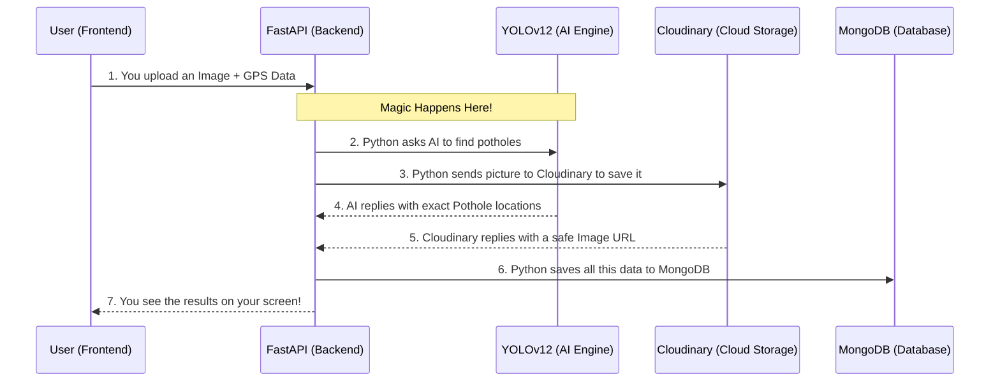

# AI-Smart City: Real-Time Crowdsourced Road Surface Monitoring

# [LIVE DEMO](https://ai-smart-city-sigma.vercel.app/)


## 🚨 Executive Summary: What is this Project?
**AI-Smart City** is a modern, Edge-to-Cloud platform that crowdsources pothole detection using state-of-the-art Artificial Intelligence. 
Think of it as "Waze for road degradation, powered by computer vision." It empowers everyday citizens to act as road inspectors while providing municipalities, city planners, and civil engineers with a real-time, interactive dashboard of infrastructure health.

## 🛑 The Problem We Are Solving
Urban road infrastructure is degrading faster than municipalities can maintain it. 
Currently, the system is fundamentally broken:
1. **Reactive, Not Proactive:** Cities generally wait for citizens to call in complaints, or for someone to pop a tire, before they realize a pothole exists. 
2. **Expensive & Slow:** Dispatching human inspectors to manually log pothole coordinates is incredibly costly and inefficient.
3. **Lack of Actionable Data:** Without a centralized, real-time map of road damage, city officials cannot prioritize repairs based on severity, traffic volume, or clustering. This leads to wasted budgets and ignored neighborhoods.

## 🌟 The Solution: What is it Doing?
AI-Smart City automates road inspection by putting a powerful AI scanner in everyone's pocket. 
Instead of filling out a complicated form, a user simply snaps a picture of a damaged road using our web app. The platform instantly analyzes the image, confirms if it is a pothole, calculates the severity (size and frequency), grabs the exact GPS coordinates, and plots it onto a live municipal heatmap. 


For **Civil Engineers**, this provides an immediate, geolocated dataset of surface degradation, completely eliminating manual survey time. 

---

## ⚙️ How It Works: The Step-by-Step Breakdown

What happens when you point your camera at a pothole? Here is the entire journey, step-by-step:



### 1. Image Capture & Geolocation (The User's Device)
- A citizen accesses the Web App on their smartphone and navigates to the "Scan" page.
- The browser asks for location permissions. Once granted, it pulls the precise **Latitude and Longitude** of the pothole.
- The user takes a picture of the road hazard. The app bundles the image and the GPS data and sends it securely to our Python server.

### 2. AI Inference (The Brain)
- The server receives the image and feeds it directly into our custom-trained **YOLOv12 (You Only Look Once)** artificial intelligence model. 
- *Why YOLOv12?* It is a state-of-the-art computer vision model that is incredibly fast and highly accurate at detecting objects (in this case, potholes) in milliseconds. 
- The AI scans the image, finds the potholes, draws mathematical "bounding boxes" around them, and assigns a confidence score (e.g., "98% sure this is a pothole"). 

### 3. Severity Calculation (The Math)
- If the AI finds potholes, the system runs an algorithm to calculate a **Severity Score** (Critical, High, Moderate, Low). 
- It does this by counting the number of potholes in the image and calculating how much of the road's surface area is destroyed. This helps cities know exactly which potholes need fixing *first*.

### 4. Image Processing & CDN Upload (The Cloud)
- We use a computer vision tool (OpenCV) to digitally draw glowing boxes around the potholes on the original image, providing visual, undeniable proof to city workers.
- Because saving thousands of high-resolution images is expensive, we instantly compress and upload the image to **Cloudinary** (a cloud storage provider). Cloudinary returns a permanent, lightweight link to the image.

### 5. Data Persistence (The Database)
- The server takes all this information—the image link, the precise GPS coordinates, the severity score, and the exact time—and logs it into our **MongoDB Atlas** database permanently. 

### 6. Real-Time Visualization (The Dashboard)
- Instantly, the user's screen updates to show them the AI's findings (with boxes drawn on their photo).
- Simultaneously, the **Municipal Dashboard** updates. A new, color-coded pin (Red for Critical, Yellow for Moderate) drops onto a live interactive map. 
- A heatmap overlay allows city planners to see exactly where infrastructure is failing the most, allowing them to dispatch asphalt trucks efficiently.

---

## 💻 The Technology Stack (For the Engineers)

We built this platform using a modern decoupled architecture, meaning the frontend (the website) and backend (the server) are completely separate but communicate seamlessly.

### **Frontend (The Face of the App)**
- **React 19 & Vite**: The core engine ensuring the app is lightning-fast and feels like a native mobile app.
- **Tailwind CSS & Framer Motion**: Provides the sleek, premium "Dark Mode" aesthetic and smooth button animations.
- **Leaflet & React-Leaflet**: The mapping engine used to plot the GPS coordinates and render the heatmaps.

### **Backend (The Heavy Lifter)**
- **FastAPI (Python)**: An ultra-fast, modern web framework built for AI data processing. 
- **YOLOv12 (Ultralytics)**: The machine learning model responsible for the actual object detection.
- **MongoDB Atlas**: Our NoSQL database, perfect for storing rapidly incoming, unstructured geospatial data.
- **Cloudinary**: Our Content Delivery Network (CDN) that ensures images load quickly anywhere in the world.

---

## 📱 The Three-Module Experience

### **1. The Landing Page**
A high-conversion entry point explaining the civic mission. Designed to immediately convey value to mayors, planners, and citizens alike.

### **2. The Scan Dashboard (The Citizen App)**
The interactive interface where users upload photos. It features real-time feedback, showing the citizen exactly what the AI sees using an HTML `<canvas>` overlay.


### **3. The Command Center (Admin Dashboard)**
A powerful tool for municipalities featuring two views:
- **The Heatmap**: A bird's-eye view of city infrastructure health. 
- **The Registry**: A chronological, scrollable database of all reported hazards, complete with severity badges and visual proof.

---

## 📸 Platform Walkthrough: Step-by-Step

Here is a visual breakdown of exactly how the AI-Smart City platform operates in the real world, from the initial landing page to generating actionable data.

### Step 1: The Landing Page
The premium, high-conversion entry point for citizens and city planners, introducing the mission and encouraging users to start reporting.
.png)

### Step 2: Understanding the Flow
A clear, user-friendly visualization provided to the user on how the edge-to-cloud system processes their data securely.
.png)

### Step 3: Accessing the Scan Dashboard
The user navigates to the "Scan Road" module. This is the AI client where the browser prepares to capture geolocation and accept an image upload.
.png)

### Step 4: Uploading the Image
The citizen uploads a photo of the damaged road surface. In the background, the exact GPS coordinates are extracted.
.png)

### Step 5: AI Detection Completed
The YOLOv12 model analyzes the image in milliseconds, identifies the pothole, calculates the severity, and draws a bounding box to show the user exactly what was detected.
.png)

### Step 6: Live Geographic Mapping
The exact location of the newly detected pothole is instantly plotted onto the municipality's interactive heatmap.
.png)

### Step 7: Detailed Hazard Information
City planners can view detailed telemetry in the registry: the AI confidence score, the assigned severity level, and visual proof of the pothole.
.png)

### Step 8: Actionable Work Orders
With all the geospatial and visual data collected, the system provides enough context to act as an actionable work order for civil maintenance crews.
.png)

---

## 📂 Project Structure

For developers jumping into the codebase, here is how things are organized:

```plaintext
ai-pothole/
├── backend/                   # Python Server (The AI & Logic)
│   ├── .env                   # Passwords and API Keys
│   ├── requirements.txt       # Python libraries needed
│   ├── best.pt                # The trained AI model weights
│   └── app/                   # The actual FastAPI code
│
└── frontend/                  # React Website (The User Interface)
    ├── package.json           # JavaScript libraries needed
    ├── src/
    │   ├── pages/             # Individual screens (Home, Map, Scan)
    │   └── components/        # Reusable pieces (Buttons, Navbars)
    └── tailwind.config.js     # Styling rules and colors
```

---

## 🚀 Beginner-Friendly Setup Guide

Want to run this full-stack AI application on your own machine? Follow these steps!

### **Prerequisites**
1. **[Node.js](https://nodejs.org/)** (v20+) for the Frontend.
2. **[Python](https://www.python.org/downloads/)** (3.10+) for the Backend.
3. Free accounts on **[MongoDB Atlas](https://www.mongodb.com/atlas/database)** and **[Cloudinary](https://cloudinary.com/)**.

### **Step 1: Configure Your Environment Variables**
You must set up your hidden `.env` files to store API keys safely.

**For the Backend:**
1. Open the `backend/` folder.
2. Rename `.env.example` to exactly `.env`.
3. Open it and fill in your Cloudinary API keys and MongoDB connection string.

**For the Frontend:**
1. Open the `frontend/` folder.
2. Rename `.env.example` to `.env`.
3. Inside, set the API URL: `VITE_API_URL=http://localhost:8000`.

### **Step 2: Start the Backend (The Python AI Server)**
Open your terminal and run these commands one by one:

```bash
cd backend

# Create a clean Virtual Environment
python -m venv venv

# Turn ON the virtual environment
# On Windows:
venv\Scripts\activate
# On Mac/Linux:
source venv/bin/activate

# Install the Python AI tools
pip install -r requirements.txt

# Start the server!
uvicorn app.main:app --reload
```
*Your backend is now running at `http://localhost:8000`! Keep this open.*

### **Step 3: Start the Frontend (The React Website)**
Open a **brand new** terminal window (keep the other one running!) and run:

```bash
cd frontend

# Install the JavaScript packages
npm install

# Start the website!
npm run dev
```

*Your platform is now live! Open your browser to `http://localhost:5173` to view it.* 🎉

---

## 🌐 Roadmap & Future Vision
- **Phase 1**: Local validation of the YOLOv12 model and UI refinement. *(Complete)*
- **Phase 2**: Global CDN integration and NoSQL deployment. *(Complete)*
- **Phase 3**: Automated integration with municipal dispatch software (e.g., automatically generating work orders for asphalt crews).

---
**AI-Smart City: Building Safer, Data-Driven Infrastructure.**
